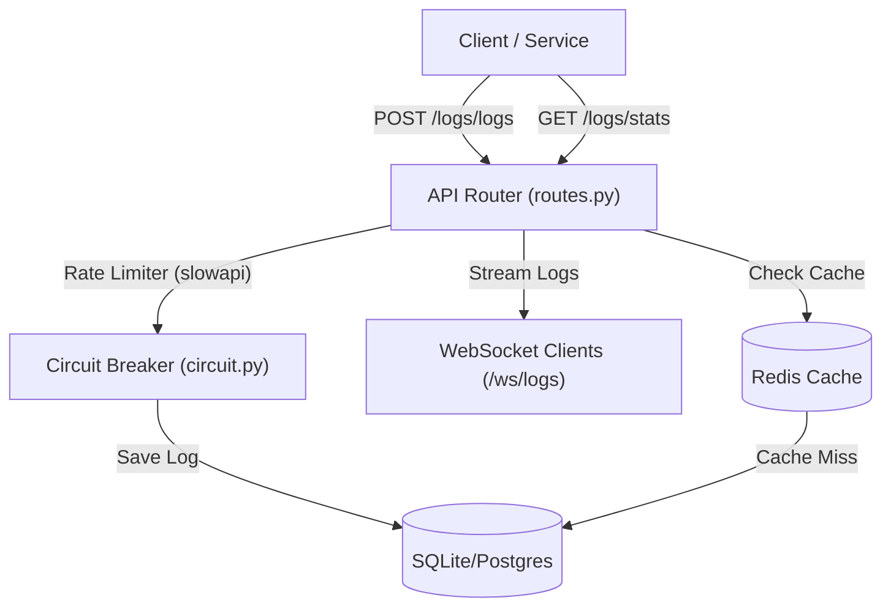

# Log Aggregation Service

A lightweight, real-time log aggregation service built with **FastAPI**, **SQLAlchemy**, **Celery**, and **Redis**.

---

## How It Works

### 1. Ingestion & Storage
- **Log Creation**: Services push logs via a `POST /logs/logs` request (defined in [app/routes.py](file:///d:/PROJECTS/log-aggregation/app/routes.py#L25)) accompanied by an API key header (`x-api-key`) verified in [app/auth.py](file:///d:/PROJECTS/log-aggregation/app/auth.py).
- **Database Storage**: Logs are written to the database using [app/crud.py](file:///d:/PROJECTS/log-aggregation/app/crud.py#L11). To prevent cascading failures under heavy load, database operations are guarded by a circuit breaker using `pybreaker` defined in [app/circuit.py](file:///d:/PROJECTS/log-aggregation/app/circuit.py).
- **Asynchronous Processing**: Background workers can process and ingest tasks asynchronously using **Celery** with a Redis broker (configured in [celery_worker.py](file:///d:/PROJECTS/log-aggregation/celery_worker.py) and [app/worker.py](file:///d:/PROJECTS/log-aggregation/app/worker.py)).

### 2. Querying & Search
- **Query Filters**: Retrieve paginated logs via `GET /logs/logs` with optional filters for service name, log level, and timestamp range.
- **Search**: Perform text-based search on log messages using `GET /logs/search`.
- **Statistics**: Fetch log aggregate metrics (total counts, levels, services) via `GET /logs/stats`. To optimize database performance, statistics are cached in **Redis** for 60 seconds (see [app/cache.py](file:///d:/PROJECTS/log-aggregation/app/cache.py)).

### 3. Real-Time Streaming
- **WebSocket Broadcasting**: Any active WebSocket connections to `/ws/logs` (handled in [app/main.py](file:///d:/PROJECTS/log-aggregation/app/main.py#L35)) will receive a real-time stream of incoming logs as they are posted to the server.

### 4. Metrics & Rate Limiting
- **Rate Limiting**: Protects ingestion from spam using `slowapi` to limit requests to 100/minute.
- **Prometheus Instrumentation**: Exposes `/metrics` for system monitoring via `prometheus-fastapi-instrumentator` in [app/main.py](file:///d:/PROJECTS/log-aggregation/app/main.py#L32).
